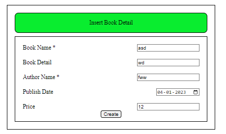

## Project Description

A college library management is a project that manages and stores books information electronically according to student's needs

## Technology Used :

- Javascript : JavaScript is used to develop the application.
- css : css is used for the style

## What I've Learnt :

I have Learnt :
- javascript function , routing ,crud, 

## Setup Project

Get a clone of application from [Here](https://github.com/sachinrao-dev/Book-Management)
open in vs code and install extension live server after that clicked into the live server

Runs the app in the development mode. Open [http://localhost:3000](http://localhost:3000) to view it in your browser.
The page will reload when you make changes. You may also see any lint errors in the console.

## Initial View of Application

## After clicked the insert book detail button 

## After successfully filled book form   

## Initial view after filled the book form
